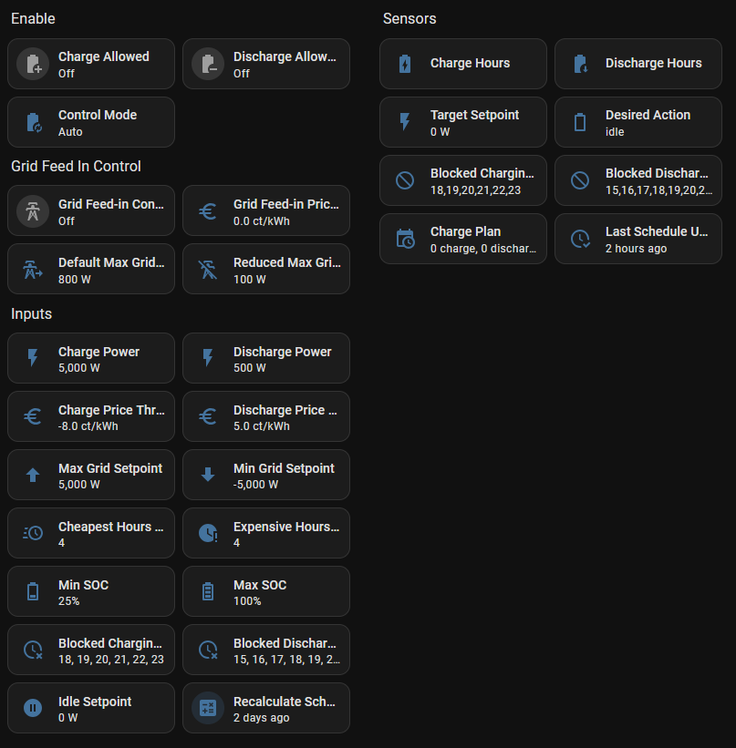

<p align="left">
    
</p>

# Victron Charge Controller for Home Assistant

[](https://github.com/hacs/integration)
[](https://opensource.org/licenses/MIT)
[](https://github.com/johannesWen/Victron-Charge-Controller/actions/workflows/ci.yml)
<!-- [](https://codecov.io/gh/johannesWen/Victron-Charge-Controller) -->

Automated battery charge/discharge control for Victron ESS systems using EPEX Spot hourly electricity prices, with a Home Assistant custom integration installable via HACS.

## What It Does

- **Auto mode:** Charges the battery during the cheapest hours and discharges during the most expensive hours, based on EPEX Spot day-ahead prices.
- **Manual mode:** Lets you pick specific hours to charge or discharge via a dashboard with clickable hour buttons.
- **Force modes:** Immediately charge or discharge at the configured power level.
- **Safety:** Enforces SOC limits, setpoint limits, and automatically shuts down if Victron entities become unavailable.

## Lovelace Dashboard Card

A Lovelace dashboard card for this integration is available in the [Victron Charge Controller Dashboard](https://github.com/johannesWen/Victron-Charge-Controller-Dashboard) repository.

| Settings Card | Plan Card |
|:---:|:---:| 
|||

## Prerequisites

| Component | Purpose |
|-----------|---------|
| Home Assistant 2026.2+ | Core platform |
| [Victron GX modbusTCP](https://github.com/sfstar/hass-victron) | Provides writable grid setpoint entity |
| [Victron Venus MQTT](https://github.com/tomer-w/ha-victron-mqtt) | Provides battery SOC, power readings |
| [EPEX Spot](https://github.com/mampfes/ha_epex_spot) | Provides hourly electricity prices |

## Installation

### HACS Custom Integration

1. Open HACS in your Home Assistant instance
2. Click the three dots menu → **Custom repositories**
3. Add `https://github.com/johannesWen/Victron-Charge-Controller` with category **Integration**
4. Click **Install**
5. Restart Home Assistant
6. Go to **Settings → Devices & Services → Add Integration → Victron Charge Control**
7. Select your Victron and EPEX Spot entities in the config flow

## Setup

After installation, add the integration via the UI:

1. Go to **Settings → Devices & Services → Add Integration**
2. Search for **Victron Charge Control**
3. Select your 6 entities:
   - **Battery SOC sensor** — battery state of charge (0–100%)
   - **Grid setpoint entity** — writable ESS grid setpoint (Watts)
   - **EPEX Spot price sensor** — hourly electricity prices
   - **Max grid feed-in entity** — writable max grid feed-in limit (Watts)

The integration creates a device with all configuration entities:

### Entities Created

| Entity | Type | Description |
|--------|------|-------------|
| Control Mode | Select | off / auto / manual / force_charge / force_discharge |
| Charge Allowed | Switch | Master enable for charging |
| Discharge Allowed | Switch | Master enable for discharging |
| Grid Feed-in Control Enabled | Switch | Enable grid feed-in limiting based on price |
| Min SOC | Number | Floor SOC — never discharge below this |
| Max SOC | Number | Ceiling SOC — never charge above this |
| Charge Power | Number | Grid import power when charging (W) |
| Discharge Power | Number | Grid export power when discharging (W) |
| Idle Setpoint | Number | Grid setpoint during idle (W) |
| Min Grid Setpoint | Number | Hard floor for setpoint (W) |
| Max Grid Setpoint | Number | Hard ceiling for setpoint (W) |
| Cheapest Hours | Number | # cheapest hours to auto-charge |
| Expensive Hours | Number | # most expensive hours to auto-discharge |
| Charge Price Threshold | Number | Max price for auto-charge (ct/kWh) |
| Discharge Price Threshold | Number | Min price for auto-discharge (ct/kWh) |
| Grid Feed-in Price Threshold | Number | Price threshold for reducing grid feed-in (ct/kWh) |
| Default Max Grid Feed-in | Number | Normal max grid feed-in power (W) |
| Reduced Max Grid Feed-in | Number | Reduced max grid feed-in power when price is low (W) |
| Blocked Charging Hours | Text | Comma-separated hours blocked for charging |
| Blocked Discharging Hours | Text | Comma-separated hours blocked for discharging |
| Recalculate Schedule | Button | Recalculate schedule from EPEX prices |
| Desired Action | Sensor | Current computed action (charge/discharge/idle) |
| Target Setpoint | Sensor | Computed grid setpoint (W) |
| Charge Hours | Sensor | Currently scheduled charge hours |
| Discharge Hours | Sensor | Currently scheduled discharge hours |
| Blocked Charging Hours | Sensor | Currently blocked charging hours |
| Blocked Discharging Hours | Sensor | Currently blocked discharging hours |
| Charge Plan | Sensor | Full hour-by-hour charge/discharge plan |
| Last Schedule Update | Sensor | Timestamp of last schedule recalculation |

### Services

| Service | Description |
|---------|-------------|
| `victron_charge_control.toggle_hour` | Cycle an hour: idle → charge → discharge → blocked → idle |
| `victron_charge_control.set_hour_action` | Set a specific hour to charge/discharge/blocked/idle |
| `victron_charge_control.set_blocked_charging_hours` | Set which hours are blocked for charging |
| `victron_charge_control.set_blocked_discharging_hours` | Set which hours are blocked for discharging |
| `victron_charge_control.calculate_schedule` | Recalculate auto schedule from EPEX prices |
| `victron_charge_control.clear_schedule` | Clear all scheduled hours |


## Configuration Defaults

| Parameter | Default | Description |
|-----------|---------|-------------|
| Min SOC | 10% | Battery won't discharge below this |
| Max SOC | 95% | Battery won't charge above this |
| Charge Power | 3000 W | Grid import power when charging |
| Discharge Power | 3000 W | Grid export power when discharging |
| Idle Setpoint | 0 W | Grid setpoint during idle |
| Min Grid Setpoint | -5000 W | Hard floor for setpoint |
| Max Grid Setpoint | 5000 W | Hard ceiling for setpoint |
| Cheapest Hours | 4 | Number of cheapest hours to auto-charge |
| Expensive Hours | 4 | Number of most expensive hours to auto-discharge |
| Charge Price Threshold | 10 ct/kWh | Only auto-charge when price ≤ this |
| Discharge Price Threshold | 20 ct/kWh | Only auto-discharge when price ≥ this |
| Grid Feed-in Price Threshold | 0 ct/kWh | Reduce feed-in when price ≤ this |
| Default Max Grid Feed-in | 5000 W | Normal max grid feed-in limit |
| Reduced Max Grid Feed-in | 0 W | Feed-in limit when price is low |
| Blocked Charging Hours | 18–23 | Hours blocked for charging |
| Blocked Discharging Hours | 15–17 | Hours blocked for discharging |

All parameters are adjustable at runtime via the UI — no YAML editing needed.

## Sign Convention

| Setpoint Value | Meaning |
|----------------|---------|
| Positive (e.g., +3000 W) | Import from grid → charge battery |
| Negative (e.g., -3000 W) | Export to grid → discharge battery |
| Zero | Idle / self-consumption |

## Home Assistant Entities



<details>
<summary>Show dashboard YAML</summary>

```yaml
  - type: sections
    max_columns: 4
    title: ESS
    path: ess
    icon: mdi:home-battery
    subview: true
    sections:
      - type: grid
        cards:
          - type: heading
            heading: Enable
            heading_style: title
          - type: tile
            entity: switch.victron_charge_control_charge_allowed
            name:
              type: entity
            vertical: false
            features_position: bottom
          - type: tile
            entity: switch.victron_charge_control_discharge_allowed
            name:
              type: entity
            vertical: false
            features_position: bottom
          - type: tile
            entity: select.victron_charge_control_control_mode
            name:
              type: entity
            vertical: false
            features_position: bottom
          - type: heading
            heading: Grid Feed In Control
            heading_style: title
          - type: tile
            entity: switch.victron_charge_control_grid_feed_in_control
            name:
              type: entity
            vertical: false
            features_position: bottom
          - type: tile
            entity: number.victron_charge_control_grid_feed_in_price_threshold
            name:
              type: entity
            vertical: false
            features_position: bottom
          - type: tile
            entity: number.victron_charge_control_default_max_grid_feed_in
            name:
              type: entity
            vertical: false
            features_position: bottom
          - type: tile
            entity: number.victron_charge_control_reduced_max_grid_feed_in
            name:
              type: entity
            vertical: false
            features_position: bottom
          - type: heading
            heading: Inputs
            heading_style: title
          - type: tile
            entity: number.victron_charge_control_charge_power
            name:
              type: entity
            vertical: false
            features_position: bottom
          - type: tile
            entity: number.victron_charge_control_discharge_power
            name:
              type: entity
            vertical: false
            features_position: bottom
          - type: tile
            entity: number.victron_charge_control_charge_price_threshold
            name:
              type: entity
            vertical: false
            features_position: bottom
          - type: tile
            entity: number.victron_charge_control_discharge_price_threshold
            name:
              type: entity
            vertical: false
            features_position: bottom
          - type: tile
            entity: number.victron_charge_control_max_grid_setpoint
            name:
              type: entity
            vertical: false
            features_position: bottom
          - type: tile
            entity: number.victron_charge_control_min_grid_setpoint
            name:
              type: entity
            vertical: false
            features_position: bottom
          - type: tile
            entity: number.victron_charge_control_cheapest_hours_auto_charge
            name:
              type: entity
            vertical: false
            features_position: bottom
          - type: tile
            entity: number.victron_charge_control_expensive_hours_auto_discharge
            name:
              type: entity
            vertical: false
            features_position: bottom
          - type: tile
            entity: number.victron_charge_control_min_soc
            name:
              type: entity
            vertical: false
            features_position: bottom
          - type: tile
            entity: number.victron_charge_control_max_soc
            name:
              type: entity
            vertical: false
            features_position: bottom
          - type: tile
            entity: text.victron_charge_control_blocked_charging_hours
            name:
              type: entity
            vertical: false
            features_position: bottom
          - type: tile
            entity: text.victron_charge_control_blocked_discharging_hours
            name:
              type: entity
            vertical: false
            features_position: bottom
          - type: tile
            entity: number.victron_charge_control_idle_setpoint
            name:
              type: entity
            vertical: false
            features_position: bottom
          - type: tile
            entity: button.victron_charge_control_recalculate_schedule
            name:
              type: entity
            vertical: false
            features_position: bottom
      - type: grid
        cards:
          - type: heading
            heading: Sensors
            heading_style: title
          - type: tile
            entity: sensor.victron_charge_control_charge_hours
            name:
              type: entity
            vertical: false
            features_position: bottom
          - type: tile
            entity: sensor.victron_charge_control_discharge_hours
            name:
              type: entity
            vertical: false
            features_position: bottom
          - type: tile
            entity: sensor.victron_charge_control_target_setpoint
            name:
              type: entity
            vertical: false
            features_position: bottom
          - type: tile
            entity: sensor.victron_charge_control_desired_action
            name:
              type: entity
            vertical: false
            features_position: bottom
          - type: tile
            entity: sensor.victron_charge_control_blocked_charging_hours
            name:
              type: entity
            vertical: false
            features_position: bottom
          - type: tile
            entity: sensor.victron_charge_control_blocked_discharging_hours
            name:
              type: entity
            vertical: false
            features_position: bottom
          - type: tile
            entity: sensor.victron_charge_control_charge_plan
            name:
              type: entity
            vertical: false
            features_position: bottom
          - type: tile
            entity: sensor.victron_charge_control_last_schedule_update
            name:
              type: entity
            vertical: false
            features_position: bottom
```

</details>
