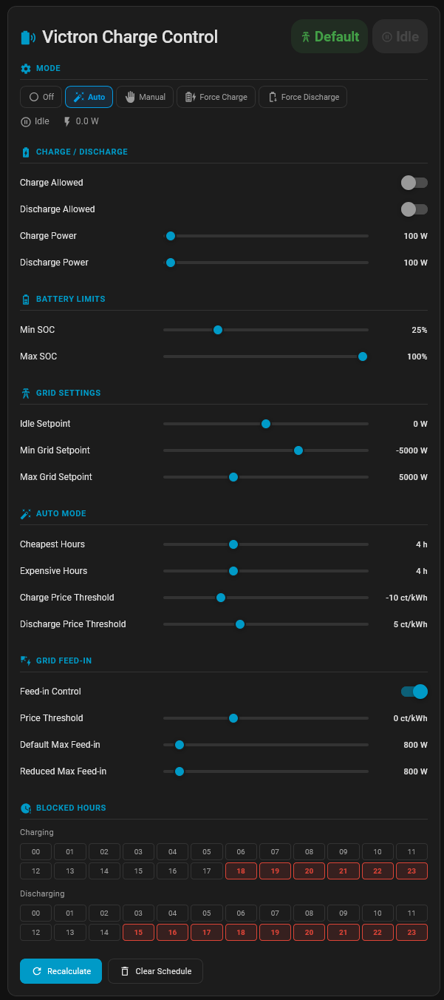
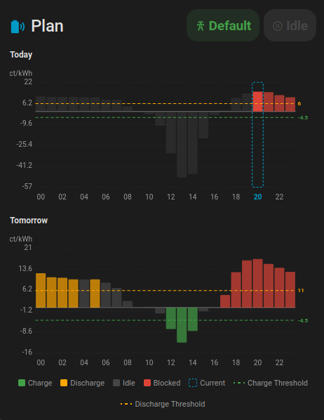
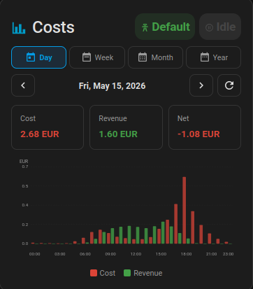

<p align="center">
  
</p>

<h1 align="center">Victron Charge Controller for Home Assistant</h1>

<p align="center">
  <strong>Automated Victron ESS charge and discharge control using EPEX Spot day-ahead prices.</strong>
</p>

<p align="center">
  <a href="https://github.com/hacs/integration"></a>
  <a href="https://github.com/johannesWen/Victron-Charge-Controller/releases"></a>
  <a href="https://github.com/johannesWen/Victron-Charge-Controller/actions/workflows/ci.yml"></a>
  <a href="https://github.com/johannesWen/Victron-Charge-Controller/blob/main/LICENSE"></a>
  <!--  -->
</p>

Victron Charge Controller is a Home Assistant custom integration for scheduling
Victron ESS battery charging and discharging around hourly energy prices. It reads
your battery SOC, EPEX Spot prices, and writable Victron grid setpoint entities,
then publishes Home Assistant controls, sensors, buttons, and services for operating
the system from dashboards or automations.

## Contents

- [Capabilities](#capabilities)
- [Dashboard Card](#dashboard-card)
- [Requirements](#requirements)
- [Installation](#installation)
- [Setup](#setup)
- [Entity Reference](#entity-reference)
- [Services](#services)
- [Defaults](#defaults)
- [Setpoint Convention](#setpoint-convention)
- [Cost And Energy Tracking](#cost-and-energy-tracking)
- [Home Assistant Entities](#home-assistant-entities)
- [Development](#development)

## Capabilities

- **Automatic scheduling** selects the cheapest hours for charging and the most expensive hours for discharging.
- **Manual scheduling** allows individual hourly actions for today and tomorrow.
- **Force modes** immediately apply the configured charge or discharge power.
- **SOC protection** respects minimum and maximum battery limits, including hysteresis.
- **Grid setpoint limits** clamp generated setpoints to configured safe boundaries.
- **Solar-surplus-aware discharge** adds the 15-minute sliding mean of an optional solar surplus sensor to the discharge setpoint, with a soft SOC fallback to solar-only export when the battery is near its lower boundary.
- **PV charging** charges the battery from solar surplus without importing from the grid, splitting surplus between battery and export according to a configurable share. PV charging is independent of the **Charge Allowed** switch and of blocked charging hours — it never draws from the grid, so it can stay active even when grid charging is disabled.
- **Feed-in management** reduces the configured max feed-in limit when prices fall below a threshold.
- **Restored state** keeps configuration, cost, and energy counters across Home Assistant restarts. The full charge/discharge plan (charge/discharge/pv_charge slots, blocked hours, last update) is also persisted and reloaded on restart — and a restart in auto mode does **not** trigger a replan, so the plan you set up the night before survives HA reboots untouched.
- **Service API** exposes schedule manipulation for dashboards, scripts, and automations.

## Dashboard Card

The integration ships a bundled Lovelace card for monitoring and steering the
controller. The card source lives under [`frontend/`](frontend/) in this
repository and is built into `custom_components/victron_charge_control/static/`
at release time. Once the integration is set up, the card is
**auto-registered** with Home Assistant (via `add_extra_js_url`) — no manual
Lovelace `resources:` entry is required.

Add the card from the Lovelace UI (**Add Card** → search for
**Victron Charge Controller**) or configure it directly:

```yaml
type: custom:victron-charge-controller-card
title: Victron Charge Control
entity_prefix: victron_charge_control
view: settings
```

| View | Purpose |
| --- | --- |
| `settings` | Operate the controller, adjust limits, configure price thresholds, tune grid feed-in behavior, and recalculate schedules. |
| `plan` | Inspect the EPEX Spot based plan for today and tomorrow, view blocked hours, and set manual actions for future hours. |
| `history` | Review grid cost, revenue, import, and export statistics by day, week, month, or year. |

| Option | Type | Default | Description |
| --- | --- | --- | --- |
| `title` | string | `Victron Charge Control` | Card title shown in the header. |
| `entity_prefix` | string | `victron_charge_control` | Prefix used by the backend integration entities. |
| `view` | string | `settings` | Card view: `settings`, `plan`, or `history`. |

| Settings | Plan |
| :---: | :---: |
|  |  |

| History |
| :---: |
|  |

> **Upgrading from the standalone dashboard repo?** Earlier releases shipped
> the card as a separate HACS "Dashboard" repository
> (`Victron-Charge-Controller-Dashboard`). That repository is now deprecated.
> Remove the old `/local/victron-charge-controller-card.js` Lovelace resource
> and update this integration to `>= 1.3.0` — the card comes bundled.

## Requirements

| Component | Purpose |
| --- | --- |
| Home Assistant | Runs the custom integration and exposes entities/services. |
| [Victron Venus MQTT](https://github.com/tomer-w/ha-victron-mqtt) | Provides battery SOC, writable ESS grid setpoint and Victron telemetry. |
| [EPEX Spot](https://github.com/mampfes/ha_epex_spot) | Provides hourly day-ahead electricity prices. |

The config flow requires a battery SOC sensor, writable grid setpoint number, EPEX Spot price sensor, and writable max grid feed-in number. Grid import/export energy sensors are optional and enable cost and energy tracking.

## Installation

### HACS

[](https://my.home-assistant.io/redirect/hacs_repository/?owner=johannesWen&repository=Victron-Charge-Controller&category=integration)

1. Search for **Victron Charge Control** in HACS and install it.
2. Restart Home Assistant after installation completes.
3. Go to **Settings** > **Devices & Services** > **Add Integration** and search for **Victron Charge Control**.
4. Complete the setup flow.

## Setup

During setup, select the entities that connect this integration to your Victron and price data:

| Field | Required | Description |
| --- | --- | --- |
| Battery SOC sensor | Yes | Battery state of charge in percent. |
| Grid setpoint entity | Yes | Writable ESS grid setpoint in watts. |
| EPEX Spot price sensor | Yes | Hourly electricity price data. |
| Max grid feed-in entity | Yes | Writable max grid feed-in limit in watts. |
| Grid consumption energy sensor | No | Cumulative grid import meter in kWh. |
| Grid feed-in energy sensor | No | Cumulative grid export/feed-in meter in kWh. |
| Solar surplus sensor | No | Current solar surplus in watts. When configured, the discharge setpoint is `-(discharge_power + 15-min mean of this value)`, clamped to the grid setpoint limits. The same sensor also enables PV charging, which splits solar surplus between battery and grid export. |

You can change these entities later from the integration options flow.

## Entity Reference

| Entity | Platform | Description |
| --- | --- | --- |
| Control Mode | Select | `off`, `auto`, `manual`, `force_charge`, or `force_discharge`. |
| Charge Allowed | Switch | Master enable for charging from the grid. PV (solar surplus) charging is independent of this switch and stays active even when it is off. |
| Discharge Allowed | Switch | Master enable for discharging. |
| Grid Feed-in Control Enabled | Switch | Enables price-based grid feed-in limiting. |
| Min SOC | Number | Lower battery SOC boundary. |
| Max SOC | Number | Upper battery SOC boundary. |
| SOC Hysteresis | Number | SOC buffer before resuming after a boundary is reached. |
| Charge Power | Number | Target import power while charging. |
| Discharge Power | Number | Target export power while discharging. |
| PV Charging Battery Share | Number | Percentage of the solar surplus routed to the battery during PV charge hours. The remainder is exported to the grid. `100` keeps all surplus in the battery, `0` exports everything. When the reduced grid feed-in mode is active, the export portion is further capped at the reduced limit, so the setpoint never asks the ESS to feed in more than the active limit allows. |
| Idle Setpoint | Number | Grid setpoint used while idle. |
| Min Grid Setpoint | Number | Lowest allowed grid setpoint. |
| Max Grid Setpoint | Number | Highest allowed grid setpoint. |
| Setpoint Deadband | Number | Minimum change (in watts) before a new grid setpoint is written. Smaller changes are skipped to avoid flapping. Set to `0` to disable. |
| Cheapest Hours | Number | Number of low-price hours selected for auto charge. |
| Expensive Hours | Number | Number of high-price hours selected for auto discharge. |
| Charge Price Threshold | Number | Maximum price for automatic charging. |
| Discharge Price Threshold | Number | Minimum price for automatic discharging. |
| Grid Feed-in Price Threshold | Number | Price at or below which feed-in is reduced. |
| Default Max Grid Feed-in | Number | Normal feed-in limit. |
| Reduced Max Grid Feed-in | Number | Feed-in limit used when prices are low. While reduced feed-in mode is active, the PV-Charge and Discharge setpoints are clamped on the export side to this value (and to `Min Grid Setpoint` when lower), so the integration never asks the ESS to feed more into the grid than the active limit allows. |
| Blocked Charging Hours | Text | Comma-separated hours excluded from charging. |
| Blocked Discharging Hours | Text | Comma-separated hours excluded from discharging. |
| Recalculate Schedule | Button | Rebuilds the schedule from current price data. |
| Desired Action | Sensor | Current computed action: charge, pv_charge, discharge, or idle. |
| Target Setpoint | Sensor | Current computed grid setpoint in watts. |
| Current Price | Sensor | Current EPEX Spot price. |
| Charge Hours | Sensor | Date-aware scheduled charging slots. |
| Discharge Hours | Sensor | Date-aware scheduled discharging slots. |
| PV Charge Hours | Sensor | Date-aware scheduled PV charging slots. PV charging only runs when a solar surplus sensor is configured. |
| Blocked Charging Hours | Sensor | Active charging block list. |
| Blocked Discharging Hours | Sensor | Active discharging block list. |
| Charge Plan | Sensor | Full hour-by-hour plan for today and tomorrow. |
| Last Schedule Update | Sensor | Timestamp of the last schedule calculation. |
| Grid Feed-in Status | Sensor | Current feed-in mode: default or reduced. |
| Grid Energy Cost | Sensor | Cumulative gross grid energy cost in EUR. |
| Grid Energy Revenue | Sensor | Cumulative gross grid energy revenue in EUR. |
| Grid Energy Import | Sensor | Cumulative tracked grid import in kWh. |
| Grid Energy Export | Sensor | Cumulative tracked grid export in kWh. |
| Solar Surplus Mean (15 min) | Sensor | Sliding 15-minute mean of the configured solar surplus sensor in watts. Unavailable when no sensor is configured. |
| Solar Surplus Mode | Sensor | `normal` while the discharge setpoint combines battery and solar, `solar_only` when the SOC is near the lower boundary and only solar surplus is exported. |

## Services

| Service | Description |
| --- | --- |
| `victron_charge_control.toggle_hour` | Cycle an hour through `idle`, `charge`, `discharge`, `blocked`, and back to `idle`. |
| `victron_charge_control.set_hour_action` | Set a specific hour to `idle`, `charge`, `discharge`, or `blocked`. |
| `victron_charge_control.set_blocked_charging_hours` | Replace the list of charging-blocked hours. |
| `victron_charge_control.set_blocked_discharging_hours` | Replace the list of discharging-blocked hours. |
| `victron_charge_control.calculate_schedule` | Recalculate the automatic schedule from EPEX Spot prices. |
| `victron_charge_control.clear_schedule` | Clear all scheduled charge and discharge hours. |

## Defaults

| Parameter | Default | Description |
| --- | --- | --- |
| Min SOC | 10% | Battery is not intentionally discharged below this level. |
| Max SOC | 95% | Battery is not intentionally charged above this level. |
| SOC Hysteresis | 2% | Buffer used before leaving SOC boundary protection. |
| Charge Power | 3000 W | Grid import power while charging. |
| Discharge Power | 3000 W | Grid export power while discharging. |
| Idle Setpoint | 0 W | Grid setpoint while idle. |
| Min Grid Setpoint | -5000 W | Lower setpoint clamp. |
| Max Grid Setpoint | 5000 W | Upper setpoint clamp. |
| Setpoint Deadband | 200 W | Minimum delta required to push a new grid setpoint. |
| Cheapest Hours | 4 | Low-price hours selected for auto charging. |
| Expensive Hours | 4 | High-price hours selected for auto discharging. |
| Charge Price Threshold | 10 ct/kWh | Auto-charge only at or below this price. |
| Discharge Price Threshold | 20 ct/kWh | Auto-discharge only at or above this price. |
| Grid Feed-in Price Threshold | 0 ct/kWh | Reduce feed-in at or below this price. |
| Default Max Grid Feed-in | 5000 W | Normal max feed-in limit. |
| Reduced Max Grid Feed-in | 0 W | Reduced feed-in limit. |
| Blocked Charging Hours | 18-23 | Default hours excluded from charging. |
| Blocked Discharging Hours | 15-17 | Default hours excluded from discharging. |

All controller parameters are adjustable at runtime through Home Assistant entities.

## Setpoint Convention

| Setpoint | Meaning |
| --- | --- |
| Positive, for example `3000 W` | Import from grid and charge the battery. |
| Negative, for example `-3000 W` | Export to grid and discharge the battery. |
| `0 W` | Idle or self-consumption. |

## Cost And Energy Tracking

Cost tracking is optional and requires cumulative grid import and grid export energy sensors. The integration keeps separate gross cost and gross revenue counters:

- Positive prices add grid consumption to cost and grid feed-in to revenue.
- Negative prices add grid consumption to revenue and grid feed-in to cost.
- Taxes, fixed fees, grid fees, and provider markups are not included.

## Home Assistant Entities


<details>
<summary>Show dashboard YAML</summary>

```yaml
  - type: sections
    max_columns: 4
    title: ESS
    path: ess
    icon: mdi:home-battery
    subview: true
    sections:
      - type: grid
        cards:
          - type: heading
            heading: Enable
            heading_style: title
          - type: tile
            entity: switch.victron_charge_control_charge_allowed
            name:
              type: entity
            vertical: false
            features_position: bottom
          - type: tile
            entity: switch.victron_charge_control_discharge_allowed
            name:
              type: entity
            vertical: false
            features_position: bottom
          - type: tile
            entity: select.victron_charge_control_control_mode
            name:
              type: entity
            vertical: false
            features_position: bottom
          - type: heading
            heading: Grid Feed In Control
            heading_style: title
          - type: tile
            entity: switch.victron_charge_control_grid_feed_in_control
            name:
              type: entity
            vertical: false
            features_position: bottom
          - type: tile
            entity: number.victron_charge_control_grid_feed_in_price_threshold
            name:
              type: entity
            vertical: false
            features_position: bottom
          - type: tile
            entity: number.victron_charge_control_default_max_grid_feed_in
            name:
              type: entity
            vertical: false
            features_position: bottom
          - type: tile
            entity: number.victron_charge_control_reduced_max_grid_feed_in
            name:
              type: entity
            vertical: false
            features_position: bottom
          - type: heading
            heading: Inputs
            heading_style: title
          - type: tile
            entity: number.victron_charge_control_charge_power
            name:
              type: entity
            vertical: false
            features_position: bottom
          - type: tile
            entity: number.victron_charge_control_discharge_power
            name:
              type: entity
            vertical: false
            features_position: bottom
          - type: tile
            entity: number.victron_charge_control_charge_price_threshold
            name:
              type: entity
            vertical: false
            features_position: bottom
          - type: tile
            entity: number.victron_charge_control_discharge_price_threshold
            name:
              type: entity
            vertical: false
            features_position: bottom
          - type: tile
            entity: number.victron_charge_control_max_grid_setpoint
            name:
              type: entity
            vertical: false
            features_position: bottom
          - type: tile
            entity: number.victron_charge_control_min_grid_setpoint
            name:
              type: entity
            vertical: false
            features_position: bottom
          - type: tile
            entity: number.victron_charge_control_cheapest_hours_auto_charge
            name:
              type: entity
            vertical: false
            features_position: bottom
          - type: tile
            entity: number.victron_charge_control_expensive_hours_auto_discharge
            name:
              type: entity
            vertical: false
            features_position: bottom
          - type: tile
            entity: number.victron_charge_control_min_soc
            name:
              type: entity
            vertical: false
            features_position: bottom
          - type: tile
            entity: number.victron_charge_control_max_soc
            name:
              type: entity
            vertical: false
            features_position: bottom
          - type: tile
            entity: text.victron_charge_control_blocked_charging_hours
            name:
              type: entity
            vertical: false
            features_position: bottom
          - type: tile
            entity: text.victron_charge_control_blocked_discharging_hours
            name:
              type: entity
            vertical: false
            features_position: bottom
          - type: tile
            entity: number.victron_charge_control_idle_setpoint
            name:
              type: entity
            vertical: false
            features_position: bottom
          - type: tile
            entity: button.victron_charge_control_recalculate_schedule
            name:
              type: entity
            vertical: false
            features_position: bottom
      - type: grid
        cards:
          - type: heading
            heading: Sensors
            heading_style: title
          - type: tile
            entity: sensor.victron_charge_control_charge_hours
            name:
              type: entity
            vertical: false
            features_position: bottom
          - type: tile
            entity: sensor.victron_charge_control_discharge_hours
            name:
              type: entity
            vertical: false
            features_position: bottom
          - type: tile
            entity: sensor.victron_charge_control_target_setpoint
            name:
              type: entity
            vertical: false
            features_position: bottom
          - type: tile
            entity: sensor.victron_charge_control_desired_action
            name:
              type: entity
            vertical: false
            features_position: bottom
          - type: tile
            entity: sensor.victron_charge_control_blocked_charging_hours
            name:
              type: entity
            vertical: false
            features_position: bottom
          - type: tile
            entity: sensor.victron_charge_control_blocked_discharging_hours
            name:
              type: entity
            vertical: false
            features_position: bottom
          - type: tile
            entity: sensor.victron_charge_control_charge_plan
            name:
              type: entity
            vertical: false
            features_position: bottom
          - type: tile
            entity: sensor.victron_charge_control_last_schedule_update
            name:
              type: entity
            vertical: false
            features_position: bottom
```

</details>

## Development

### Build the bundled card

The Lovelace card is a Lit + Rollup project under [`frontend/`](frontend/). The
build writes the bundled module into the integration's `static/` directory, which
the integration serves and auto-loads.

```bash
cd frontend
npm install
npm run build     # -> ../custom_components/victron_charge_control/static/victron-charge-controller-card.js
```

For iterative development with rebuild-on-save:

```bash
npm run watch
```

The `static/` directory is gitignored — the built card is produced at release
time by CI and included in the HACS release zip (`victron_charge_control.zip`).

### Local Home Assistant

A Docker Compose stack is provided for testing the integration together with the
bundled card against dummy Victron/EPEX entities.

```bash
cd frontend && npm install && npm run build && cd ..
docker compose up -d
```

Then open <http://localhost:8123>. Because the card is auto-loaded by the
integration, no manual Lovelace resource entry is required. See
[`dev/README.md`](dev/README.md) for backfilling cost statistics and the dummy
sensor configuration.
